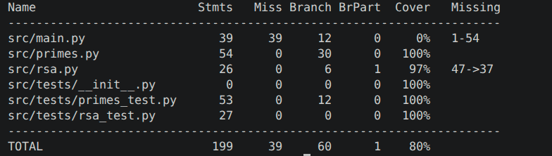

# Testausdokumentti

## Yksikkötestauksen kattavuusraportti

## Mitä on testattu ja minkälaisilla syötteillä

### Yksikkötestit

Satunnaisten parittomien lukujen luonti väliltä [2^1023, 2^1024) (funktio sample_odd_number primes.py moduulista). Yksikkötestit testaavat että luku on pariton, sekä että luku kuuluu halutulle intervallille. Funktion toimivuus testataan lisäämällä sata sen luomaa numeroa listaan ja tarkistamalla jokaiselle numerolle listalla, että yllä mainitut testit läpäisevät.

Sieve of Eratosthenes -algoritmin toiminta (primes.py moduulista). Yksikkötestit testaavat että algoritmi löytää kaikki alkuluvut, jotka ovat pienempiä tai yhtäsuuria kuin 100 ja 500, algoritmin palauttamaa tulosta verrataan sitten oikeaan listaan alkuluvuista näiden rajojen alapuolelta. Valitut rajat ovat edustavia algoritmin käyttötarkoitukseen. Tämän lisäksi testataan, että syötteet jotka ovat pienempiä kuin 2 palauttavat tyhjän listan, sillä 2 on pienin alkuluku. Tätä testataan syötteillä 1 ja -21.

Miller-Rabin-testin toiminta (primes.py moduulista). Miller-Rabin-testin yksikkötestit testaavat, että testi osaa tunnistaa alkuluvut, komposiittiluvut, sekä Carmichaelin luvut, jotka ovat joukko yhdistettyjä lukuja, jotka kuitenkin huijaavat yksinkertaisemmat alkulukutestit kuten Fermat'n testin. Käytän jokaisessa kategoriassa syötteinä kahta eri lukua, joista yksi on pieni luku ja toinen suuri 1024 bittinen luku, jonka on tarkoitus edustaa syötteitä joita algoritmi ottaa vastaan RSA-algoritmia käyttäessä. Miller-Rabin on pohjimmiltaan stokastinen testi, mutta kun kierrosten määrä on 15 (joka se on automaattisesti toteutuksessa) niin todennäköisyys että algoritmi palauttaa väärän vastauksen on 1 - 0.999999999 eli noin 1 kerran miljardista. Tämän perusteella testi toimii käytännössä determinisesti.

Laajenettu Eukleideen -algoritmi (rsa.py moduuli). Algoritmi etsii suurimman yhteisen tekijän kahdelle eri luvulle, sekä sen Bezout kertoimet, eli kertoimet x, y joille pätee että xa + yb = gcd(a, b). Yksikkötestit testaavat että algoritmi löytää oikeat arvot x, y ja gcd(a, b) kolmelle eri syötteelle. Yksi näistä on pari pieniä yhdistettyjä lukuja, toinen pari pieniä alkulukuja ja kolmas on pari 1024 bittisiä lukuja, jotka vastaavat paremmin itse algoritmissa käytettävien lukujen pituutta.

### Muut testit

### Integraatiotestit

get_prime funktion (primes.py moduuli) toiminta. Funktio hyödyntää funktioita sieve_of_eratosthenes, sample_odd_number ja miller_rabin_test. Sen on tarkoitus palauttaa 1024 bittinen alkuluku. Integraatiotestit luovat funktiolla luvun, jonka jälkeen ne testaavat että luku kuuluu välille [2^1023, 2^1024), luku on pariton ja että luku on alkuluku. Alkuluvun testaamiseen ei löydy Pythonin standardi kirjatosta mitään metodeja, joten päädyin käyttämään Sympy kirjastoa, josta löytyy matematiikka funktioita, sen testaamiseen, jos tähän löytyy parempi ratkaisu niin siirryyn käyttämään sitä.

generate_keys funktio (rsa.py moduuli), joka kutsuu sisällään funktioita get_prime ja extended_euclidian_algorithm. Funktion palauttaa RSA-algoritmissa käytettävän julkis-, yksityisavain parin, joka koostuu kolmesta luvusta, eli luvusta N joka kuuluu molempiin avaimiin, luvusta e joka kuuluu julkiseen avaimeen ja luvusta d joka kuuluu yksityiseen avaimeen. Yksikkötestit testaavat että molempien avainparien pituus on 2, eli että ne koostuvat luvusta N ja joko luvusta e tai d. Tämän lisäksi testit testaavat että luku N on molemissa avainpareissa sama.

## Miten testit voi toistaa?

Testit voi suorittaa komennolla: poetry run coverage run --branch -m pytest

Ja tulostaa konsoliin komennolla: poetry run coverage report -m
